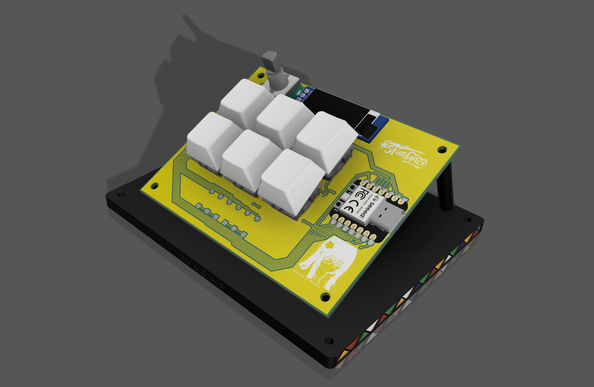
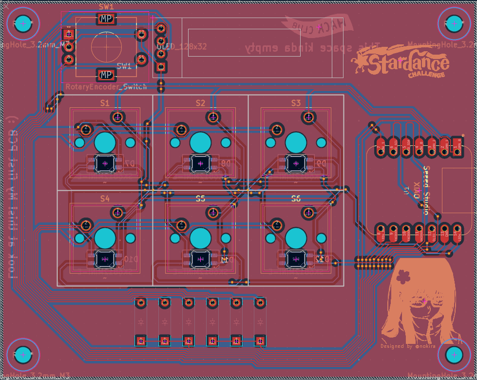
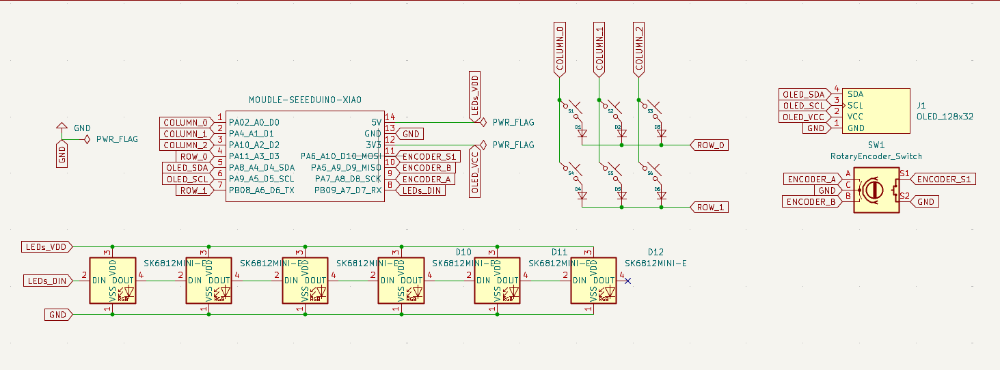
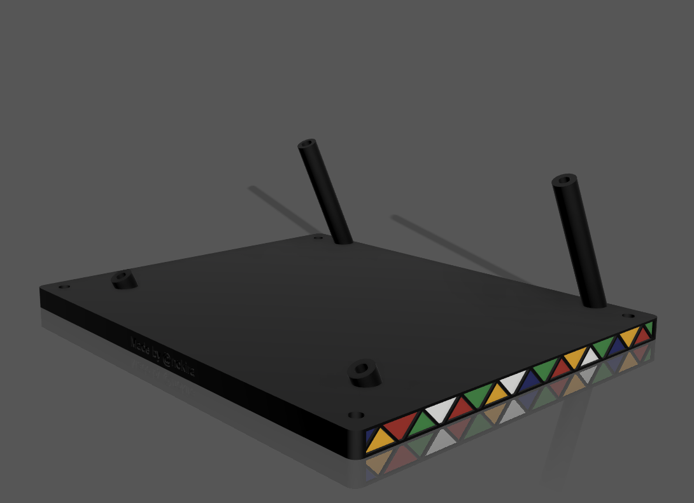

# Nokira's Hackpad!
Simple macropad with 6 keys, 1 rotary encoder and an OLED Display.

This is an open-case hackpad. You could say it was because I don't know how to build a case... maybe. But I like how  everything turned out.

###### Built Stardance!! [Project page here](https://stardance.hackclub.com/projects/50923)

---



# PCB

Made in KiCad!

# Schematic

Made in KiCad!

# Case

Made in Fusion!

# Firmware

QMK was used for everything.
The features of this hackpad are:
- Rotary encoder to change volume
- OLED disaply to show last action
- 6 Keys for macros

### The macros are:

```
┌──────┬──────┬──────┐
│ PREV │ PLAY │ NEXT │
├──────┼──────┼──────┤
│  F13 │  F14 │ LOCK │
└──────┴──────┴──────┘
```

- PREV > Previous Media
- PLAY > Play or Stop current Media
- NEXT > Next Media
- F13 > Free Macro Mey
- F14 > Free Macro Key
- LOCK > Lock Screen

# Bill Of Materials

| Component | Quantity |
| :--- | :---: |
| 1N4148 Diodes | 6 |
| MX-Style switches | 6 |
| SK6812 MINI-E LEDs | 6 |
| EC11 Rotary encoder | 1 |
| 0.91 inch OLED display | 1 |
| Seeed XIAO RP2040 | 1 |

# Extra notes:

Please keep in mind this is my first project of this kind. I never touched KiCad nor Fusion before.
This was made as a learning project to get started into this world. In the future I will continue learning and hopfully deliver more polished projects :)
